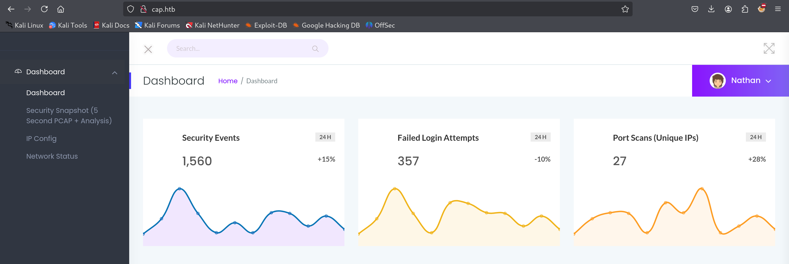

Tonight we'll play an easy box, the one which I choose is Cap.

# Footprint
Once the box is started, i run an Nmap scan against the target, which revealed the presence of a software called _gunicorn_ running on port 80.

Let's visit it!

At a first glance, we can observe that in homepage there are network traffic information. Let's play around..

The _/ip_ endpoint is giving as output the result of "ifconfig" command, while "_/netstat_" is showing the whole command's output.

While playing around with the _security snapshot_ function in menu, it appears that we can download network traffic logs, and currently we are at number 2: let's try to download 1 and 0, hoping that we can find something interesting.

the endpoint "_/data/0_" contains some credentials in cleartext which, by analyzing the pcap extraction, were used to login with the user _n****n_ into the FTP service.

Redirecting to data which does not belong to our user is called an **IDOR**.

# Gaining Access

Once logged in with the user, we came in front of user.txt, which contains the first flag:

First flag done =)

# Privilege Escalation

The box cames with other services enabled, like ssh, so let's spray these credentials.

Apparently, the user n****n cannot run sudo, so let's import LinPEAS inside the machine.

Here we have python3.8 with _cap_setuid_ and _cap_net_bind_service_ enabled. According to [GTFOBins](https://gtfobins.github.io/gtfobins/python/#suid) we can leverage the _cap_setuid_ to achieve root on machine. Let's try! :)

That was an easy box which works as a light introduction in packet analysis and IDOR vulnerability.

Enjoy! :)