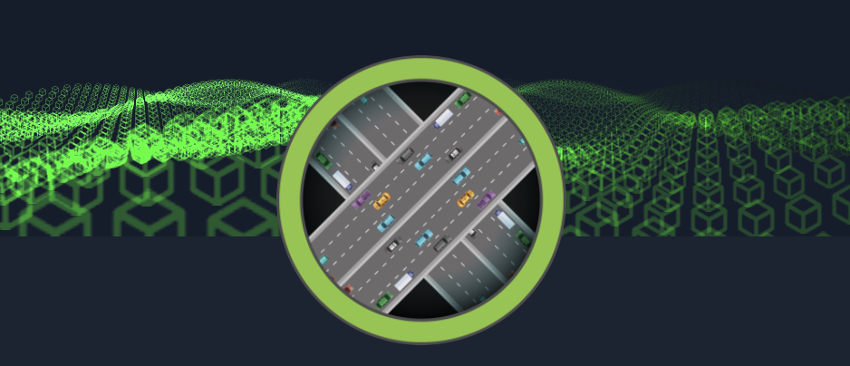
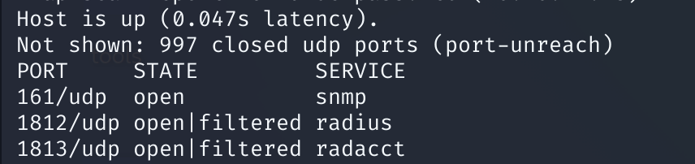
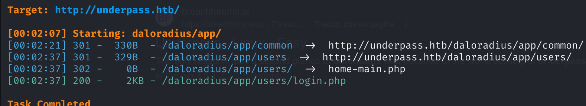
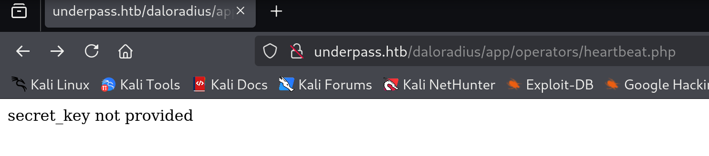

  

Tonight target easy box is called _UnderPass_, what will we find?

# Footprint

Let's start with an _Nmap_ scan:

  

We see the port 80 opened. Let's check! (:

  

There's an apache2 web server: now we start digging.

After various enumeration activities including fuzzing, we see that no files or diretory were found.

Let's start again, trying to enumerate other services that can be abused.

  

# Enumeration

We see that there's an SNMP opened port (161), so let's gather more info:

  

We collected the username _steve_ and the _daloradius_ installation. Let's check!

  

Fuzz more and more:

  

  

Gotcha! (:

# Initial Access

  

Once googled, I tried default credentials _administrator/radius,_ but them not worked. Let's enumerate more...

Possible hints for fuzzing are:

-common/

-users/

-operators/

  

  

We have successfully logged in with default credentials in /operators/login.php, so now we continue digging around, figuring out something that can give us a reverse shell or login informations to access ssh! (:

Looking around users lists, we found _svcMosh_ with respective encrypted possible md5 password:

  

Let's fire up our hashcat an decrypt this sheeeeet!! (:

  

Leeeeeesgoooo! We now login via ssh and start enumerating privileges with "sudo -l" (but do not forget to cat user.txt):

  

# Privilege Escalation

To escalate privileges, we need to use mosh to spawn a shell as super user, let's try:

  

  

Good game, we just finished this box! (:

Happy exploiting ^-^